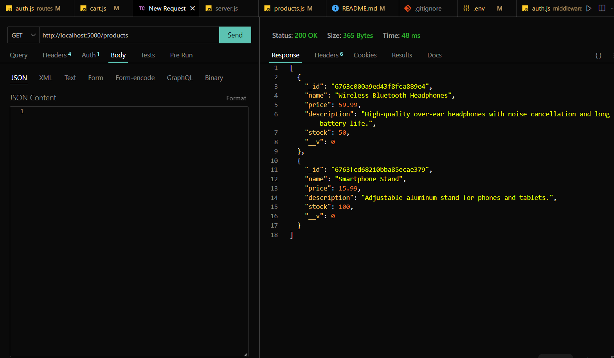

# ShoppyGlobe Backend

# Github Link : https://github.com/parthu311/Backend-ShoppyGlobe

This repository contains the backend implementation for ShoppyGlobe, an e-commerce application. The backend is built using Node.js, Express.js, and MongoDB. It includes features like product management, shopping cart functionality, user authentication, and authorization.

## Table of Contents
- [Project Overview](#project-overview)
- [Features](#features)
- [Technologies Used](#technologies-used)
- [Project Structure](#project-structure)
- [Setup Instructions](#setup-instructions)
- [API Endpoints](#api-endpoints)
- [Error Handling and Validation](#error-handling-and-validation)
- [Authentication and Authorization](#authentication-and-authorization)
- [Testing](#testing)
- [Screenshots](#screenshots)
- [Submission](#submission)

---

## Project Overview

The ShoppyGlobe backend provides a robust API for handling product listings, shopping cart management, and user authentication. It integrates MongoDB for data storage and ensures a secure API using JWT-based authentication.

## Features

### 1. Node.js and Express API
- Fetch a list of products.
- Fetch product details by ID.
- Add a product to the shopping cart.
- Update product quantities in the cart.
- Remove a product from the cart.

### 2. MongoDB Integration
- Store product and cart data in MongoDB collections.
- Perform CRUD operations on products and cart items.

### 3. Error Handling and Validation
- Handle errors for all API routes.
- Validate user inputs (e.g., check product ID existence before cart operations).

### 4. Authentication and Authorization
- JWT-based authentication.
- User registration and login functionality.
- Protect cart-related routes to allow only authenticated users.

### 5. Testing with ThunderClient
- All API routes tested using ThunderClient.

## Technologies Used
- **Node.js**
- **Express.js**
- **MongoDB** (using Mongoose)
- **JWT** for authentication
- **ThunderClient** for API testing

## Project Structure
```
backend-shoppyglobe
├── middleware
│   └── auth.js          # Middleware for authentication
├── models
│   ├── Cart.js          # Schema for cart items
│   ├── Product.js       # Schema for products
│   └── User.js          # Schema for user authentication
├── routes
│   ├── auth.js          # Routes for user authentication
│   ├── cart.js          # Routes for cart operations
│   └── products.js      # Routes for product operations
├── .env                 # Environment variables
├── package.json         # Dependencies and scripts
├── server.js            # Entry point of the application
└── README.md            # Project documentation
```

## Setup Instructions

### Prerequisites
- Node.js and npm installed.
- MongoDB database set up locally or on a cloud platform .

### Steps
1. Clone the repository:
   ```bash
   git clone https://github.com/parthu311/Backend-ShoppyGlobe
   cd shoppyglobe-backend
   ```
2. Install dependencies:
   ```bash
   npm install
   ```
3. Create a `.env` file in the root directory and add the following:
   ```env
   PORT=5000
   MONGO_URI=your_mongodb_connection_string
   JWT_SECRET=your_jwt_secret
   ```
4. Start the server:
   ```bash
   node server.js
   ```
5. Access the API at `http://localhost:5000`.

## API Endpoints

### Product Routes
| Method | Endpoint          | Description                           |
|--------|-------------------|---------------------------------------|
| GET    | `/products`       | Fetch all products                   |
| GET    | `/products/:id`   | Fetch a product by its ID            |

### Cart Routes (Protected)
| Method | Endpoint            | Description                             |
|--------|---------------------|-----------------------------------------|
| POST   | `/cart`             | Add a product to the cart              |
| PUT    | `/cart/:id`         | Update product quantity in the cart    |
| DELETE | `/cart/:id`         | Remove a product from the cart         |

### Authentication Routes
| Method | Endpoint          | Description                           |
|--------|-------------------|---------------------------------------|
| POST   | `/register`       | Register a new user                  |
| POST   | `/login`          | Authenticate user and return JWT     |

## Error Handling and Validation
- All routes include appropriate error handling.
- Input validation ensures invalid or missing data is rejected with meaningful error messages.

## Authentication and Authorization
- JWT is used to protect routes.
- Only logged-in users can access cart operations.
- Authentication middleware (`auth.js`) verifies the JWT token.

## Testing
All API endpoints were tested using ThunderClient. Testing screenshots are included in the `/screenshots` folder.

## Screenshots
- GET/products and mongoDB
    
    

-Post products and mongoDB
    
    

-Register and data on monogo
    
    

-login 
    

-cart add item using id 
    

-put and update item using id 
    

-delete cart 
    


---

### Author
Parth

---

### License
This project is licensed under the MIT License.

